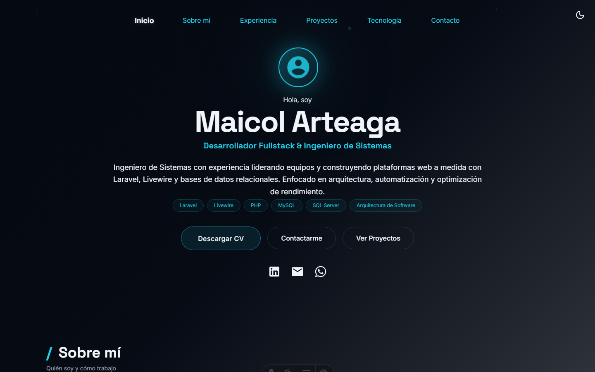
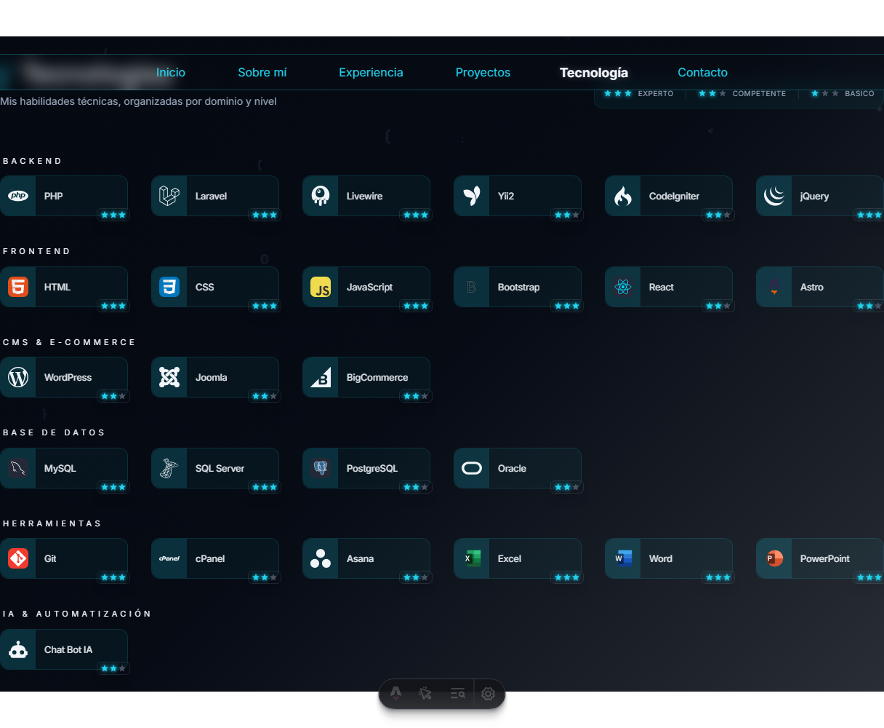

# Portfolio de Maicol Arteaga

**🔴 Sitio en vivo:** [maicolart07.github.io/portfolio](https://maicolart07.github.io/portfolio/)

Portfolio personal de **Maicol Erick Arteaga Guzmán**, Ingeniero de Sistemas y
Desarrollador Fullstack (Bolivia). Construido sobre la plantilla Astro
[*Career Portfolio*](https://astro.build/themes/details/career-portfolio-data-driven-astro-ssg/)
y personalizado por completo con contenido real: experiencia laboral,
tecnologías, habilidades y educación extraídos directamente de su CV.

<p align="center">
  
</p>
<p align="center">
  
</p>

## ✨ Qué incluye

El sitio es de una sola página (`/`) con las siguientes secciones:

| Sección | Contenido |
|---|---|
| **Inicio** | Nombre, rol, especialidades, botones de CV / contacto / proyectos, redes sociales |
| **Sobre mí** | Resumen profesional y fortalezas clave |
| **Experiencia** | Timeline con 5 empleos reales, logros y stack tecnológico por puesto |
| **Proyectos** | Tarjetas de proyectos (lista para completar — ver [Cómo agregar contenido](#-cómo-agregar-o-actualizar-contenido)) |
| **Tecnologías** | 26 tecnologías reales agrupadas por categoría, con ícono y nivel |
| **Habilidades** | Fortalezas blandas (liderazgo, arquitectura, resolución de problemas, etc.) |
| **Estadísticas** | Años de experiencia, empresas, tecnologías, proyectos y certificaciones — **calculadas automáticamente** desde los datos, no hardcodeadas |
| **Educación** | Timeline académico |
| **Certificaciones** | Formación complementaria |
| **Contacto** | Formulario (abre el cliente de correo con el mensaje prellenado) + tarjetas de redes |

Incluye modo claro/oscuro, animaciones al hacer scroll, y un tema de color
propio ("Cyan Tech") no incluido en la plantilla original.

## 🛠️ Stack técnico

- **[Astro 6](https://astro.build/)** — sitio estático, sin JS de más
- **[Tailwind CSS 4](https://tailwindcss.com/)** — estilos
- **[astro-icon](https://www.astroicon.dev/) / [Iconify](https://iconify.design/)** — toda la iconografía (`mdi`, `simple-icons`, `skill-icons`, `devicon-plain`, `vscode-icons`)
- **GitHub Actions + GitHub Pages** — build y despliegue automático en cada push a `main`

## 🚀 Cómo correrlo en local

```bash
npm install       # instalar dependencias
npm run dev       # levanta el servidor de desarrollo (localhost:4321)
npm run build     # genera el sitio de producción en ./dist
npm run preview   # sirve el build de producción localmente
```

## ✏️ Cómo agregar o actualizar contenido

Este sitio es **100% data-driven**: casi todo el contenido vive en archivos
JSON dentro de `src/data/`, no hace falta tocar componentes para actualizar
información.

| Quiero cambiar... | Edito el archivo |
|---|---|
| Nombre, rol, especialidades, redes, link del CV | `src/data/home.json` |
| Experiencia laboral | `src/data/career.json` |
| Educación | `src/data/education.json` |
| Certificaciones | `src/data/certifications.json` |
| Habilidades blandas | `src/data/skills.json` |
| Tecnologías / stack | `src/data/tech.json` |
| Proyectos | `src/data/projects.json` |
| Color del tema | `src/config.ts` → `baseTheme` |

Para agregar un proyecto, cada objeto en `projects.json` sigue este esquema:

```json
{
  "title": "Nombre del proyecto",
  "description": "Descripción corta.",
  "images": ["archivo.webp"],
  "tech": ["Laravel", "MySQL"],
  "platforms": ["web"],
  "category": "Proyecto Profesional",
  "status": "En producción",
  "repoUrl": "https://github.com/usuario/repo",
  "demoUrl": "https://demo-en-vivo.com"
}
```

Las imágenes van en `src/assets/` (Astro las optimiza automáticamente al
buildear).

> Para el detalle completo de cada sección, decisiones tomadas y pendientes,
> ver [`CLAUDE.md`](CLAUDE.md). Para la historia completa de cómo se construyó
> este sitio, sesión por sesión, ver [`HISTORIAL.md`](HISTORIAL.md).

## 🌐 Despliegue

El sitio se despliega solo a **GitHub Pages** vía GitHub Actions
(`.github/workflows/deploy.yml`) cada vez que se hace push a `main`. No
requiere ningún paso manual adicional una vez configurado.

## 🙏 Créditos

Basado en la plantilla open-source
[*Career Portfolio: Data-Driven Astro SSG*](https://astro.build/themes/details/career-portfolio-data-driven-astro-ssg/).
El README original de la plantilla (con instrucciones genéricas de
instalación y créditos del autor) se conserva en
[`TEMPLATE-README.md`](TEMPLATE-README.md).

## 📝 Licencia

[MIT](LICENSE)
